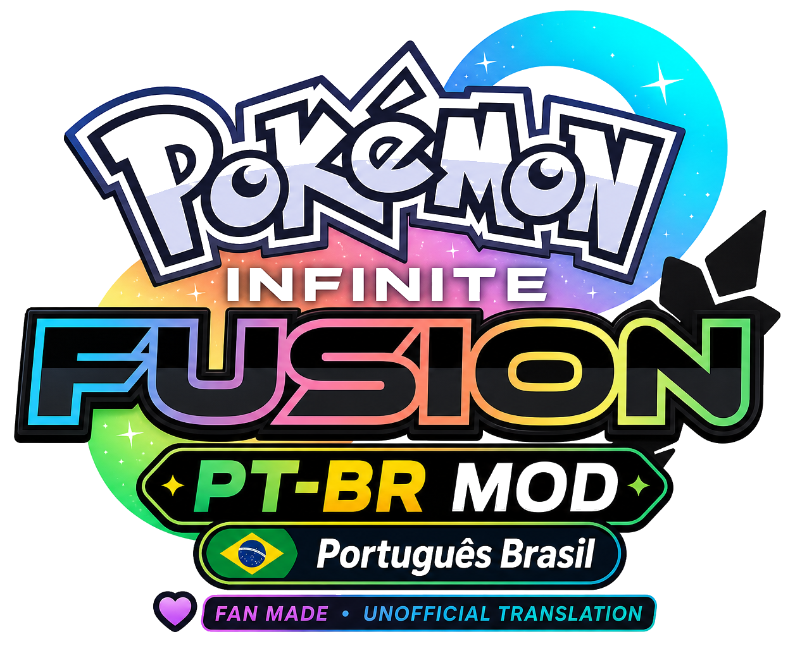
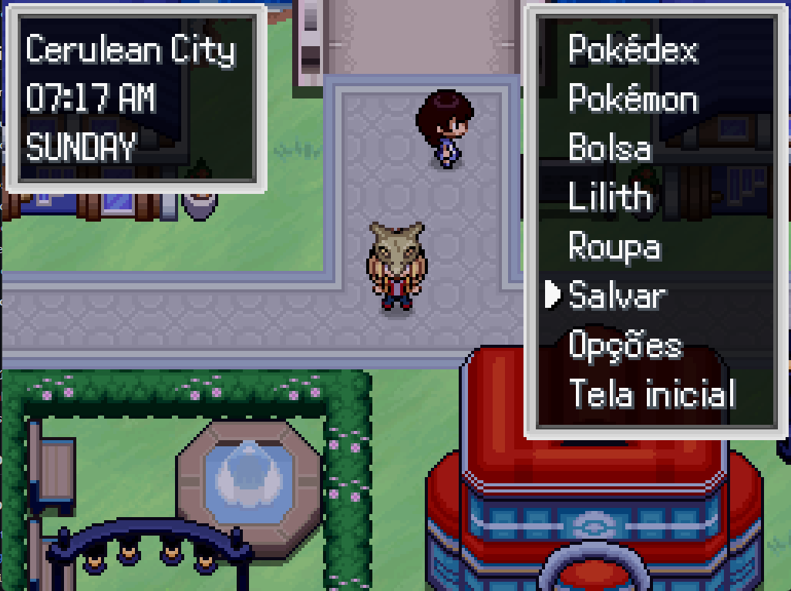
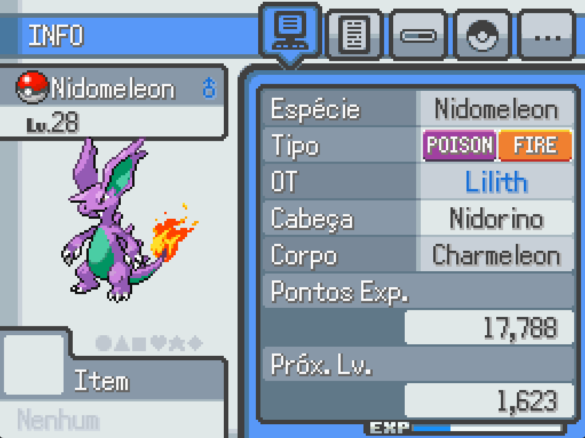
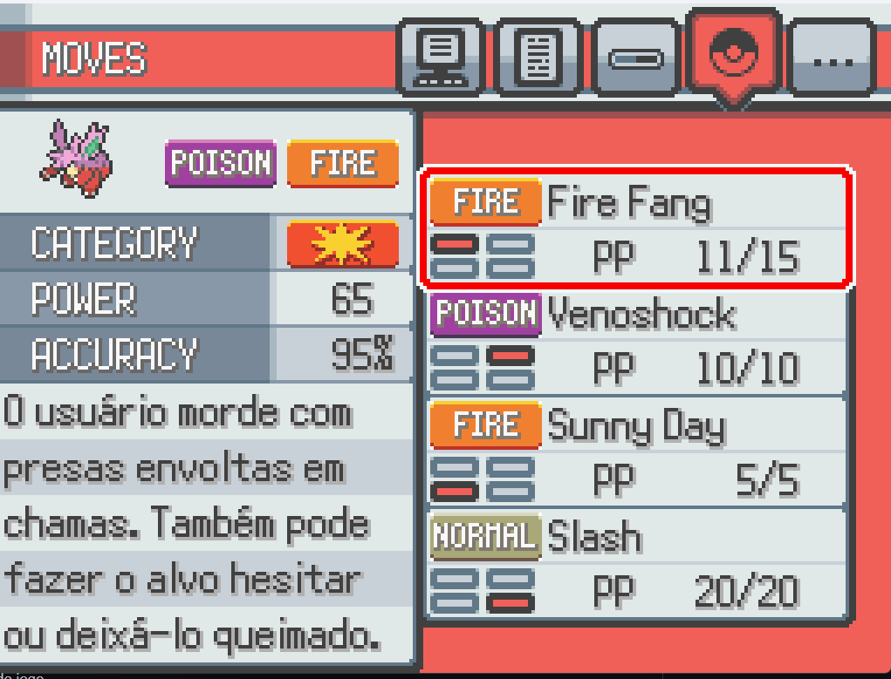
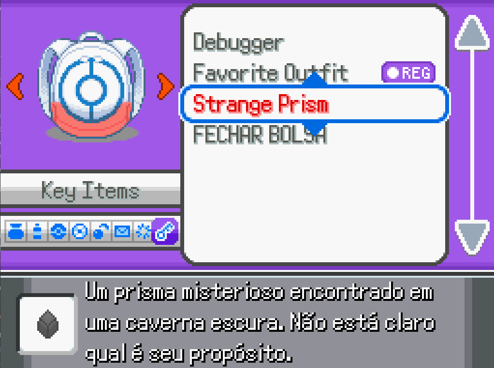
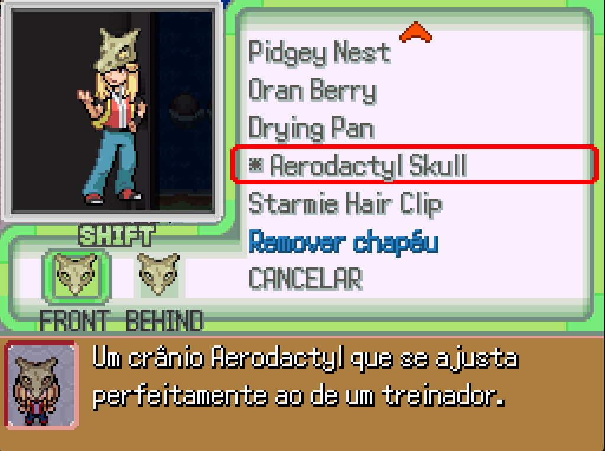
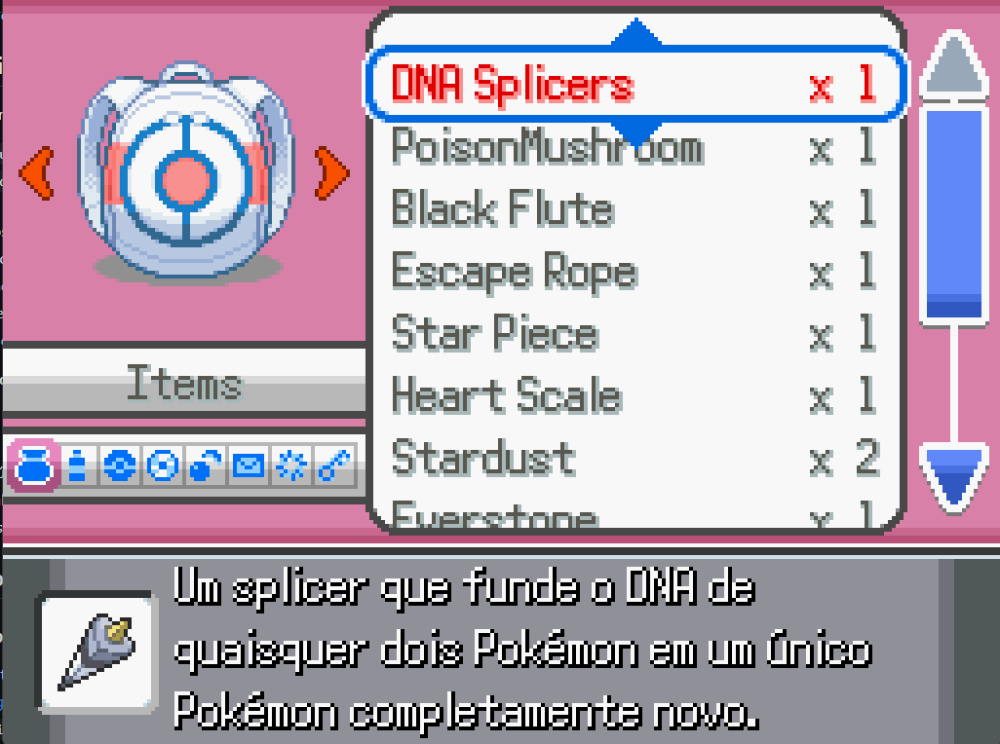
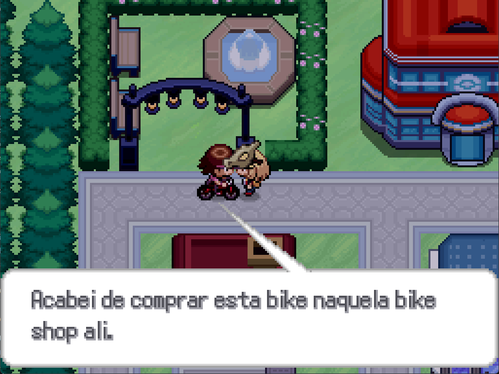
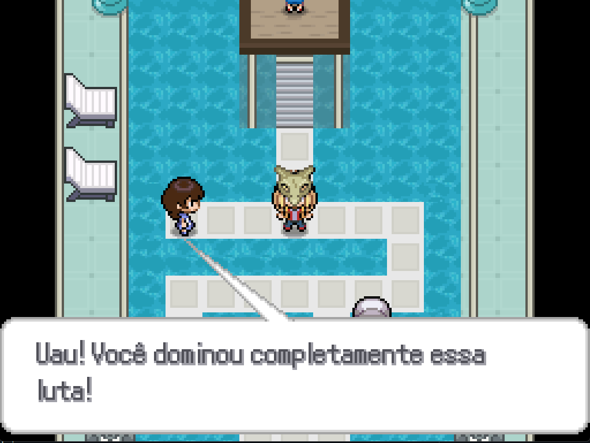

# Pokemon Infinite Fusion PT-BR Fan Translation

<picture>
  <source media="(prefers-color-scheme: dark)" srcset="assets/infinite-fusion-ptbr-mod-logo-github-dark-bg.png">
  
</picture>


**Version:** 1.1.0<br>
**Language:** Brazilian Portuguese<br>
**Status:** fan-made release candidate for public testing and feedback<br>
**Repository:** https://github.com/ExtremestoneGG/infinite-fusion-ptbr<br>
**Downloads:** https://github.com/ExtremestoneGG/infinite-fusion-ptbr/releases

> **Important:** this is an unofficial, fan-made translation project. It is not affiliated with, endorsed by, or presented as official by the Pokemon Infinite Fusion developers, Nintendo, Game Freak, The Pokemon Company, or any related rights holder.

> **Safety notice:** this repository does **not** include the game. Download Pokemon Infinite Fusion only from the official Pokemon Infinite Fusion Discord maintained by the game developers. Do not download the game from random websites, mirrors, reuploads, or "easy installer" pages, because fake downloads and malware have been reported in the community.

## What This Is

This is a Brazilian Portuguese fan translation patch for **Pokemon Infinite Fusion**. The goal is to make the game's story, quests, dialogue, menus, descriptions, and gameplay text comfortable for Brazilian players while preserving the names that Brazilian Pokemon fans are already used to reading in English.

The project was coordinated by a designer and AI enthusiast, not by a professional programmer. AI was used as a tool to help extract text, maintain consistency, draft translations, and run validation passes. The project is open to feedback, corrections, human review, and improvements from the community.

This is made **by fans, for fans**. It does not try to replace the official project or pretend to be official. If the Pokemon Infinite Fusion team ever finds this useful as a reference for an official localization workflow, that would be amazing, but the current release should be treated as a community testing build.

## Translation Showcase

<table>
  <tr>
    <td></td>
    <td></td>
    <td></td>
  </tr>
  <tr>
    <td></td>
    <td></td>
    <td></td>
  </tr>
  <tr>
    <td></td>
    <td></td>
  </tr>
</table>

## What Was Translated

The translation focuses on readable Portuguese while preserving the Pokemon vocabulary most Brazilian players already use:

| Translated | Preserved in English |
| --- | --- |
| Story dialogue | Pokemon names |
| Quest text | Move names |
| NPC dialogue, including shops and services | Item names |
| Gameplay menus and UI text | Ability names |
| Pokedex UI labels | NPC names |
| Item descriptions | Location names |
| Move descriptions | Organization names |
| Ability descriptions/effects | Type/element names |
| Nature names | Drawn or bitmap text |
| Outfit, hat, and hairstyle descriptions | Original credits and sprite author names |

Example: an item name like **Pokeball** or **Rare Candy** remains in English, but the explanation of what it does can be translated into Portuguese.

## Coverage Snapshot

These numbers describe the extracted and packaged PT-BR scope for v1.1.0. Hidden hardcoded text may still appear during public testing and should be reported with screenshots. Pokedex species/fusion descriptions are not counted as complete in this release; they are planned as future work.

| Category | Current Status | Remaining Known Work | Coverage |
| --- | ---: | ---: | ---: |
| Story, dialogue, quests, menus, and language database entries | 20,581 / 20,581 extracted entries generated | Hidden hardcoded/event strings may still appear in public testing | 99% |
| Gameplay UI and hardcoded script text | 106 / 106 packaged files synced | Screenshot-driven polish is ongoing | 98% |
| Item, move, ability effect, Nature, and stat descriptions/labels | Covered in the language/script scope | More in-game spot checks | 98% |
| Outfit, hat, and hairstyle descriptions | 314 / 314 known descriptions | 0 known descriptions | 100% |
| Submitted v1.1.0 battle text issues | 18 / 18 known strings | 0 from the current report set | 100% |
| Pokedex UI labels | Included in UI/script scope | Species/fusion entries are future work | 85% |
| Pokedex species/fusion descriptions | Deferred | Future project, not counted in v1.1.0 | 0% |
| Preserved names and drawn/bitmap text | Not translated by design | Not part of PT-BR scope | N/A |

## What Changed

This release contains:

- `Data/portuguese.dat`, a new Brazilian Portuguese language data file.
- 105 script files with translated gameplay UI strings and language support adjustments.
- A text patch for outfit descriptions. Pokedex species/fusion mappings are excluded from the v1.1.0 installer payload and planned as future work.
- A rebuilt graphical Windows `.exe` installer with `Game.exe` selection, automatic scan, backup, install/update, validation, and restore options.
- A separate BAT/PowerShell package for users who prefer transparent scripts.
- Validation reports documenting what was checked before release.

This release does **not** include:

- The game executable.
- Full game downloads.
- Sprites, music, graphics packs, or updater downloads.
- Random files from a local game installation.
- The unofficial sprite cache or downloaded sprite updates.

## Installation

### Quick Tutorial

1. Download and install Pokemon Infinite Fusion from the **official Pokemon Infinite Fusion Discord only**.
2. Open the [Releases page](https://github.com/ExtremestoneGG/infinite-fusion-ptbr/releases).
3. Download `InfiniteFusionPTBRInstaller-v1.1.0.exe`, the recommended graphical installer. Do not use this project as a game download.
4. Run `InfiniteFusionPTBRInstaller-v1.1.0.exe`.
5. Click `Choose Game.exe` and select the game's `Game.exe`, or use `Scan` to look for likely game folders automatically.
6. Confirm the install message. Backup is required and will be created inside the selected game folder.
7. Wait while the installer copies the translated files and applies the outfit text patches. Older machines may take a few minutes.
8. Start the game.
9. Open the language menu and select `Português`.

To undo the patch, open `InfiniteFusionPTBRInstaller-v1.1.0.exe` again and click `Restore Latest Backup`.

### After Official Game Updates

If you update Pokemon Infinite Fusion with the official updater `.bat`, run `InfiniteFusionPTBRInstaller-v1.1.0.exe` again **before opening your save** and click `Install / Update PT-BR`. Official updates can replace translated scripts with the original English files, so reinstalling the translation keeps the game files and your save in the same expected state.

If the game crashes after an update, reinstall the PT-BR translation first. If that does not fix it, restore the latest `PTBR_BACKUPS` backup or make a fresh official game install and apply the translation again.

If Windows SmartScreen warns about the file, it is because this is a small unsigned fan tool. The installer source code is included in `installer-src/InfiniteFusionPtbrInstaller.cs`.

If you prefer the script-based method, download the separate `PTBR-Translation-BAT-v1.1.0.zip` package and follow [docs/BAT_INSTALLER.md](docs/BAT_INSTALLER.md).

### How The Installer Works

The recommended installer is `InfiniteFusionPTBRInstaller-v1.1.0.exe`. It is a small WPF app with the PT-BR payload embedded inside the executable, so the main download does not need a folder full of files.

The `.bat` installer is not included inside the recommended `.exe` ZIP. It is shipped separately as `PTBR-Translation-BAT-v1.1.0.zip`, which includes `installer/Install-PTBR.bat`, `installer/Install-PTBR.ps1`, and `installer/Restore-Latest-Backup.bat`.

The installer:

- Checks if the selected folder looks like Pokemon Infinite Fusion.
- Creates a required backup in `PTBR_BACKUPS` inside the selected game folder.
- Copies the Portuguese language file and translated script files.
- Applies text-only patches to outfit descriptions. Pokedex species/fusion mappings are not included in the v1.1.0 installer payload.
- Keeps the game's executable, sprites, music, saves, and unrelated files untouched.

### Restore Tutorial

1. Open `InfiniteFusionPTBRInstaller-v1.1.0.exe`.
2. Select the same Pokemon Infinite Fusion folder used during installation.
3. Click `Restore Latest Backup`.
4. The installer restores the newest backup from `PTBR_BACKUPS`.
5. Files created by the translation installer are removed, and overwritten files are restored.

Fallback option: if you installed through the BAT package, run `installer/Restore-Latest-Backup.bat` and select the same game folder.

If you want to be extra careful, copy your save folder before testing any mod or fan patch.

## Installer Notes

The installer is intentionally simple and transparent:

- The recommended package is a single unsigned `.exe`, and its source code is included.
- The separate BAT package uses readable PowerShell scripts.
- It does not need administrator access.
- The downloaded installer packages do not connect to the internet.
- It does not download the game.
- It validates that the selected folder looks like a Pokemon Infinite Fusion installation.
- It creates a timestamped backup in `PTBR_BACKUPS` inside the selected game folder before changing files.
- It can restore the latest backup.

See [docs/INSTALLER.md](docs/INSTALLER.md) for the `.exe` method and [docs/BAT_INSTALLER.md](docs/BAT_INSTALLER.md) for the BAT/PowerShell method.

### One-Line PowerShell Method

Advanced users can also open PowerShell inside the Pokemon Infinite Fusion folder and run this command:

```powershell
powershell -NoProfile -ExecutionPolicy Bypass -Command "irm https://raw.githubusercontent.com/ExtremestoneGG/infinite-fusion-ptbr/main/scripts/install-from-github.ps1 | iex"
```

That command downloads the script package from this GitHub release, creates a required backup, installs the PT-BR files, and cleans up its temporary installer folder. Only run it from the folder that contains `Game.exe` and `Data`.

## Validation Summary

Release 1.1.0 was checked with a final validation sweep:

- Base translated language entries: `20,581`
- Outfit description mappings: `314`
- Direct payload files synced with the translated game folder: `106`
- Packaged script files: `105`
- Pokedex species/fusion descriptions are deferred to a future project and are not counted as complete in v1.1.0.
- Active Pokedex payload entries in installer: `0`.
- Outfit names were preserved; only descriptions were translated.
- v1.1.0 battle text issues from the current screenshot report set fixed: `18/18`
- README showcase screenshots added: `8`

The full machine-readable validation report is available at [docs/reports/validation_report.json](docs/reports/validation_report.json).

## Known Issues

### Official Updater / Save Compatibility Crash

After running the official game updater `.bat`, or after restoring the game to an untranslated/original state, a save that was last used with the PT-BR translation may crash with this error:

`Script 'MultiSaves.rb' line 786: NoMethodError occurred. undefined method '[]' for nil:NilClass`

This usually means the save and the current game scripts/data are out of sync, not that the save is permanently lost. Close the game, run the PT-BR installer again, select the same `Game.exe`, and click `Install / Update PT-BR`. For extra safety before official updates, manually copy your save folder from `%APPDATA%\infinitefusion`.

v1.1.0 does not edit save files automatically. Save backup/repair automation is being treated as future installer work.

## Feedback

This first public release is meant to be tested. Reports are welcome for:

- Awkward context or tone.
- Dialogue that feels out of order.
- UI text that clips or does not fit.
- Any untranslated dialogue that is not intentionally preserved.
- Any Pokemon, move, item, ability, NPC, or location name that was accidentally translated.
- Bugs caused by installation or restore.

Please include screenshots, the map/location, and what language option was active when reporting issues.

## Credits And Respect

All credit for Pokemon Infinite Fusion belongs to its creators and contributors. This repository is only a fan translation patch and exists because Brazilian players love the game and want to enjoy its story in Portuguese.

If you are part of the Pokemon Infinite Fusion team and want this project changed, removed, restructured, or adapted into a cleaner localization format, please reach out through the repository issues.

---

# Tradução PT-BR Fanmade de Pokemon Infinite Fusion

**Versão:** 1.1.0<br>
**Idioma:** Português do Brasil<br>
**Status:** versão fanmade para testes públicos e feedback<br>
**Repositório:** https://github.com/ExtremestoneGG/infinite-fusion-ptbr<br>
**Downloads:** https://github.com/ExtremestoneGG/infinite-fusion-ptbr/releases

> **Importante:** este é um projeto de tradução não oficial, feito por fã. Ele não é afiliado, aprovado, endossado nem apresentado como oficial pelos desenvolvedores de Pokemon Infinite Fusion, Nintendo, Game Freak, The Pokemon Company ou qualquer detentor relacionado.

> **Aviso de segurança:** este repositório **não** inclui o jogo. Baixe Pokemon Infinite Fusion somente pelo Discord oficial de Pokemon Infinite Fusion mantido pelos desenvolvedores. Não baixe o jogo por sites aleatórios, mirrors, reuploads ou páginas prometendo instalador fácil, porque downloads falsos e malware já foram relatados pela comunidade.

## O Que É Este Projeto

Esta é uma tradução fanmade para Português do Brasil de **Pokemon Infinite Fusion**. O objetivo é deixar história, quests, diálogos, menus, descrições e textos de gameplay confortáveis para jogadores brasileiros, mantendo em inglês os nomes que a comunidade BR de Pokemon já está acostumada a usar.

O projeto foi coordenado por um designer e entusiasta de IA, não por um programador profissional. IA foi usada como ferramenta para ajudar na extração de textos, consistência, rascunhos de tradução e validações. O projeto está aberto a feedback, correções, revisão humana e melhorias da comunidade.

Isto foi feito **de fã para fã**. A tradução não tenta substituir o projeto oficial nem fingir que é oficial. Se um dia a equipe de Pokemon Infinite Fusion achar este trabalho útil como referência para uma localização oficial, seria incrível, mas esta versão deve ser tratada como uma build comunitária de testes.

## Demonstração Da Tradução

<table>
  <tr>
    <td></td>
    <td></td>
    <td></td>
  </tr>
  <tr>
    <td></td>
    <td></td>
    <td></td>
  </tr>
  <tr>
    <td></td>
    <td></td>
  </tr>
</table>

## O Que Foi Traduzido

A tradução tenta soar natural em português sem mexer no vocabulário de Pokemon que jogadores brasileiros já costumam usar em inglês:

| Traduzido | Mantido em inglês |
| --- | --- |
| Diálogos da história | Nomes de Pokemon |
| Textos de quests | Nomes de golpes |
| Falas de NPCs, incluindo lojas e serviços | Nomes de itens |
| Menus e textos de interface | Nomes de habilidades |
| Labels da interface da Pokédex | Nomes de NPCs |
| Descrições de itens | Nomes de lugares |
| Descrições de golpes | Nomes de organizações |
| Descrições/efeitos de habilidades | Tipos/elementos |
| Nomes das Natures | Textos desenhados/bitmap |
| Descrições de roupas, chapéus e cabelos | Créditos e autores de sprites |

Exemplo: um item como **Pokeball** ou **Rare Candy** continua com o nome em inglês, mas a explicação do que ele faz pode aparecer em português.

## Resumo De Cobertura

Estes números descrevem o escopo PT-BR extraído e empacotado na v1.1.0. Textos escondidos em scripts/eventos ainda podem aparecer durante os testes públicos e devem ser reportados com prints. As descrições de espécies/fusões da Pokédex não contam como concluídas nesta versão; elas ficam para um projeto futuro.

| Categoria | Status atual | Falta conhecida | Cobertura |
| --- | ---: | ---: | ---: |
| História, diálogos, quests, menus e entradas do banco de idioma | 20.581 / 20.581 entradas extraídas geradas | Textos escondidos em eventos/scripts ainda podem aparecer nos testes públicos | 99% |
| Interface e textos hardcoded em scripts | 106 / 106 arquivos empacotados sincronizados | Polimento por prints continua | 98% |
| Descrições/labels de itens, golpes, efeitos de habilidades, Natures e stats | Coberto no escopo de idioma/scripts | Mais checagens dentro do jogo | 98% |
| Descrições de roupas, chapéus e cabelos | 314 / 314 descrições conhecidas | 0 descrições conhecidas | 100% |
| Problemas de texto de batalha reportados na v1.1.0 | 18 / 18 textos conhecidos | 0 do conjunto atual de reports | 100% |
| Labels da interface da Pokédex | Incluído no escopo de interface/scripts | Entradas de espécies/fusões ficam para depois | 85% |
| Descrições de espécies/fusões da Pokédex | Adiado | Projeto futuro, fora da contagem da v1.1.0 | 0% |
| Nomes preservados e textos desenhados/bitmap | Não traduzidos por escolha | Fora do escopo PT-BR | N/A |

## O Que Foi Alterado

Esta release contém:

- `Data/portuguese.dat`, um novo arquivo de idioma em Português do Brasil.
- 105 arquivos de script com textos de interface traduzidos e ajustes de suporte ao idioma.
- Um patch de texto para descrições de roupas. As descrições da Pokédex não contam como concluídas na v1.1.0.
- Um instalador gráfico `.exe` refeito para Windows com seleção por `Game.exe`, busca automática, backup, instalação/atualização, validação e restauração.
- Um pacote separado em BAT/PowerShell para quem prefere scripts transparentes.
- Relatórios de validação documentando o que foi checado antes da release.

Esta release **não** contém:

- Executável do jogo.
- Download completo do jogo.
- Sprites, músicas, pacotes gráficos ou updater.
- Arquivos aleatórios de uma instalação local.
- Cache de sprites ou sprites baixados por atualizador.

## Instalação

### Tutorial Rápido

1. Baixe e instale Pokemon Infinite Fusion **somente pelo Discord oficial de Pokemon Infinite Fusion**.
2. Abra a [página de Releases](https://github.com/ExtremestoneGG/infinite-fusion-ptbr/releases).
3. Baixe `InfiniteFusionPTBRInstaller-v1.1.0.exe`, o instalador gráfico recomendado. Não use este projeto como download do jogo.
4. Execute `InfiniteFusionPTBRInstaller-v1.1.0.exe`.
5. Clique em `Escolher Game.exe` e selecione o `Game.exe` do jogo, ou use `Escanear` para procurar possíveis pastas do jogo automaticamente.
6. Confirme a mensagem de instalação. O backup é obrigatório e será criado dentro da pasta escolhida do jogo.
7. Aguarde enquanto o instalador copia os arquivos traduzidos e aplica os patches de texto das roupas. Em computadores mais antigos isso pode levar alguns minutos.
8. Abra o jogo.
9. Entre no menu de idioma e selecione `Português`.

Para desfazer a instalação, abra `InfiniteFusionPTBRInstaller-v1.1.0.exe` de novo e clique em `Restore Latest Backup`.

### Depois De Atualizar O Jogo Oficialmente

Se você atualizar Pokemon Infinite Fusion pelo updater oficial `.bat`, rode `InfiniteFusionPTBRInstaller-v1.1.0.exe` de novo **antes de abrir seu save** e clique em `Instalar / Atualizar PT-BR`. Updates oficiais podem trocar os scripts traduzidos pelos arquivos originais em inglês, então reinstalar a tradução mantém os arquivos do jogo e o save no mesmo estado esperado.

Se o jogo crashar depois de um update, reinstale primeiro a tradução PT-BR. Se isso não resolver, restaure o backup mais recente em `PTBR_BACKUPS` ou faça uma instalação oficial limpa do jogo e aplique a tradução novamente.

Se o Windows SmartScreen avisar sobre o arquivo, é porque ele é uma ferramenta pequena de fã e não possui assinatura digital. O código-fonte do instalador está incluído em `installer-src/InfiniteFusionPtbrInstaller.cs`.

Se você preferir o método por script, baixe o pacote separado `PTBR-Translation-BAT-v1.1.0.zip` e siga [docs/BAT_INSTALLER.md](docs/BAT_INSTALLER.md).

### Como O Instalador Funciona

O instalador recomendado é `InfiniteFusionPTBRInstaller-v1.1.0.exe`. Ele é um pequeno app WPF com o pacote PT-BR embutido dentro do executável, então o download principal não precisa vir como uma pasta cheia de arquivos.

O instalador `.bat` não fica dentro do download principal em `.exe`. Ele é distribuído separadamente como `PTBR-Translation-BAT-v1.1.0.zip`, que inclui `installer/Install-PTBR.bat`, `installer/Install-PTBR.ps1` e `installer/Restore-Latest-Backup.bat`.

O instalador:

- Verifica se a pasta escolhida parece ser o Pokemon Infinite Fusion.
- Cria um backup obrigatório em `PTBR_BACKUPS` dentro da pasta escolhida do jogo.
- Copia o arquivo de idioma português e os scripts traduzidos.
- Aplica patches somente de texto nas descrições de roupas. Descrições da Pokédex ficam para trabalho futuro.
- Mantém executável, sprites, músicas, saves e arquivos não relacionados do jogo sem mexer.

### Tutorial De Restauração

1. Abra `InfiniteFusionPTBRInstaller-v1.1.0.exe`.
2. Selecione a mesma pasta do Pokemon Infinite Fusion usada na instalação.
3. Clique em `Restore Latest Backup`.
4. O instalador restaura o backup mais recente dentro de `PTBR_BACKUPS`.
5. Arquivos criados pelo instalador da tradução são removidos, e arquivos sobrescritos são restaurados.

Alternativa: se você instalou pelo pacote BAT, execute `installer/Restore-Latest-Backup.bat` e selecione a mesma pasta do jogo.

Se quiser ter cuidado extra, copie sua pasta de saves antes de testar qualquer mod ou patch fanmade.

## Sobre O Instalador

O instalador foi feito para ser simples e transparente:

- O pacote recomendado é um `.exe` único e sem assinatura digital, com código-fonte incluído.
- O pacote BAT separado usa scripts PowerShell legíveis.
- Não precisa de administrador.
- Os pacotes baixados não acessam a internet.
- Não baixa o jogo.
- Verifica se a pasta selecionada parece uma instalação do Pokemon Infinite Fusion.
- Cria um backup com data e hora em `PTBR_BACKUPS` dentro da pasta escolhida do jogo antes de alterar arquivos.
- Consegue restaurar o backup mais recente.

Veja [docs/INSTALLER.md](docs/INSTALLER.md) para o método `.exe` e [docs/BAT_INSTALLER.md](docs/BAT_INSTALLER.md) para o método BAT/PowerShell.

### Método PowerShell Em Uma Linha

Usuários avançados também podem abrir o PowerShell dentro da pasta do Pokemon Infinite Fusion e rodar:

```powershell
powershell -NoProfile -ExecutionPolicy Bypass -Command "irm https://raw.githubusercontent.com/ExtremestoneGG/infinite-fusion-ptbr/main/scripts/install-from-github.ps1 | iex"
```

Esse comando baixa o pacote de scripts desta release no GitHub, cria backup obrigatório, instala os arquivos PT-BR e limpa a pasta temporária do instalador. Rode somente dentro da pasta que contém `Game.exe` e `Data`.

## Resumo Da Validação

A versão 1.1.0 passou por uma varredura final:

- Entradas traduzidas do arquivo base de idioma: `20.581`
- Mapeamentos de descrições de roupas/chapéus/cabelos: `314`
- Arquivos diretos do payload sincronizados com a pasta traduzida do jogo: `106`
- Arquivos de script empacotados: `105`
- Descrições de espécies/fusões da Pokédex ficam para um projeto futuro e não contam como concluídas na v1.1.0.
- Nomes de roupas foram preservados; apenas descrições foram traduzidas.
- Textos de batalha da v1.1.0 reportados no conjunto atual de prints corrigidos: `18/18`
- Imagens de demonstração adicionadas ao README: `8`

O relatório completo em formato de máquina está em [docs/reports/validation_report.json](docs/reports/validation_report.json).

## Erros Conhecidos

### Crash De Save Após Update Oficial

Depois de rodar o updater oficial `.bat` do jogo, ou depois de restaurar o jogo para um estado original/sem tradução, um save usado pela última vez com a tradução PT-BR pode crashar com este erro:

`Script 'MultiSaves.rb' line 786: NoMethodError occurred. undefined method '[]' for nil:NilClass`

Isso normalmente indica que o save e os scripts/dados atuais do jogo estão fora de sincronia, não que o save foi perdido para sempre. Feche o jogo, rode o instalador PT-BR de novo, selecione o mesmo `Game.exe` e clique em `Instalar / Atualizar PT-BR`. Por segurança, antes de updates oficiais, copie manualmente a pasta de saves em `%APPDATA%\infinitefusion`.

A v1.1.0 não edita arquivos de save automaticamente. Backup/reparo automático de save fica como trabalho futuro do instalador.

## Feedback

Esta primeira release pública foi feita para ser testada. Feedbacks são bem-vindos sobre:

- Contexto ou tom estranho.
- Diálogos que pareçam fora de ordem.
- Textos de interface cortados ou apertados.
- Qualquer fala não traduzida que não faça parte das exceções.
- Qualquer nome de Pokemon, golpe, item, habilidade, NPC ou local que tenha sido traduzido por acidente.
- Bugs na instalação ou restauração.

Ao reportar, mande prints, o local/mapa, e qual idioma estava selecionado no jogo.

## Créditos E Respeito

Todo o crédito por Pokemon Infinite Fusion pertence aos criadores e contribuidores do jogo. Este repositório é apenas um patch de tradução fanmade e existe porque jogadores brasileiros amam o jogo e querem aproveitar a história em português.

Se você faz parte da equipe de Pokemon Infinite Fusion e quer que este projeto seja alterado, removido, reestruturado ou adaptado para um formato melhor de localização, abra uma issue no repositório.
